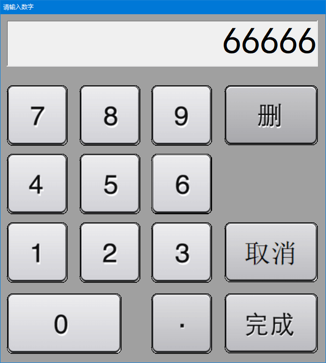
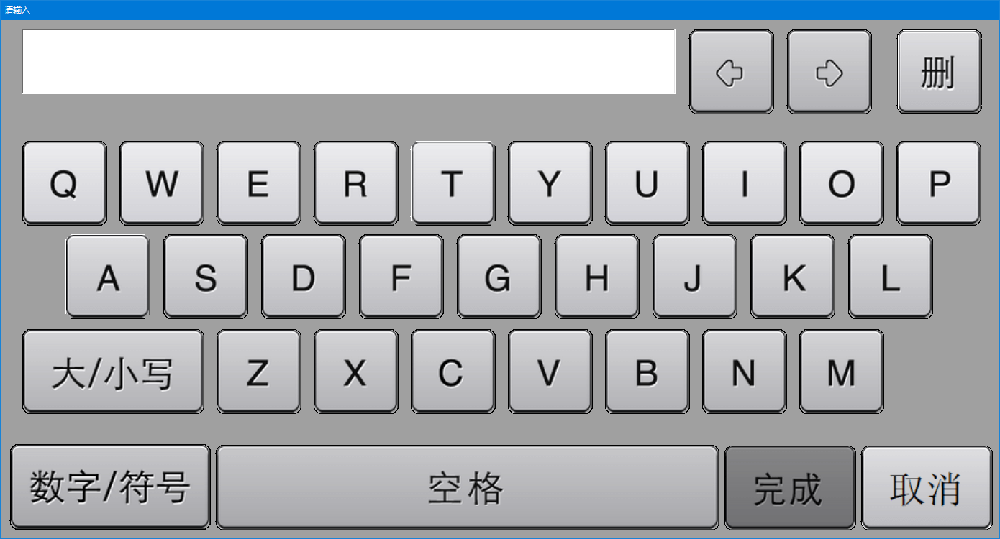
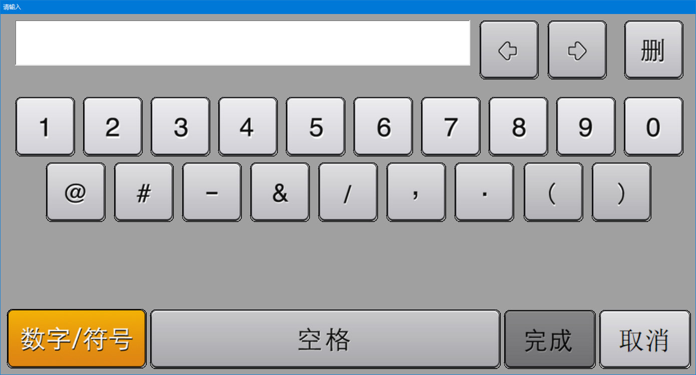

# C# SoftKeyboard

C# 软键盘输入框，可以用来在触屏上替代普通的输入框。

包含两个 class : SoftKeyboard9 （9键）和 SoftKeyboard26 （26键）


## SoftKeyboard9

SoftKeyboard9 是9键（数字键）输入框，只能用于输入正整数或正小数，得到 string 类型，而不是 int 类型。

SoftKeyboard9 的调用方式举例如下：

```C#
string age = "";
if ( SoftKeyboard.SoftKeyboard9.Show("请输入年龄", ref age) ) {
    // 用户点了“完成”，则执行这里
    Console.WriteLine("你的年龄是:" + age);
} else {
    // 用户点了“取消”，则执行这里
}
```

|        |
| :----------------------------: |
| **图1**： SoftKeyboard9 的界面 |


## SoftKeyboard26

SoftKeyboard26 是26键（全键）输入框，可用于输入大小写26个字母、数字、部分特殊符号。

SoftKeyboard26 的调用方式与 SoftKeyboard9 相同。

|  |
| :----------------------------: |
|  **图2**： SoftKeyboard26 的界面  |

|                             |
| :-------------------------------------------------------: |
| **图3**： SoftKeyboard26 的界面（切换到了数字/符号输入模式） |

